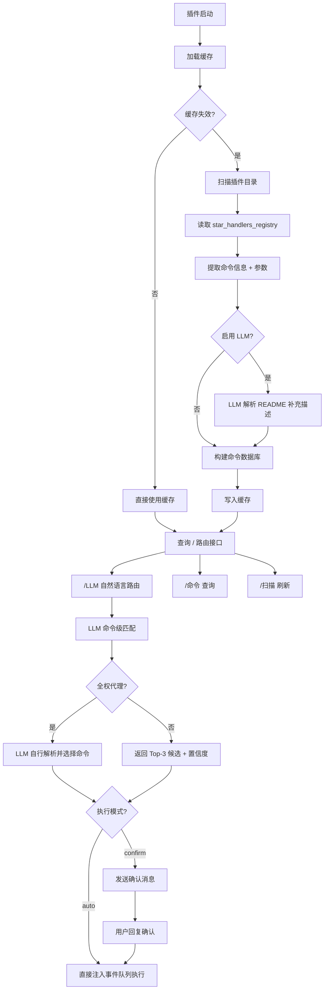

# astrbot_plugin_command_displayer

> **AstrBot 插件命令中枢 · LLM 驱动 · 自动扫描 · 命令路由**

[](https://github.com/Soulter/AstrBot)
[](LICENSE)

---

## 插件简介

**Command Displayer** 是一个**开发给~~记不住插件命令又懒得看后台的懒狗~~的插件**，用于**自动收集、解析并展示 AstrBot 中所有已安装插件的命令信息**。

核心亮点：

- **LLM 命令级路由**：用自然语言描述需求，AI 直接匹配到**具体的一条命令**（而非整个插件），并可自动执行
- **双执行模式**：`auto` 模式直接执行，`confirm` 模式先确认后执行（支持回复"确认/是/yes/ok/好"确认，"取消/no/算了"取消）
- **LLM 全权代理**：开启后 LLM 接收全部命令缓存，自行解析意图、选择命令和提取参数
- **直接读取 + LLM 补充描述**：优先读取已注册指令，同时通过 LLM 解析 README 补充命令描述，提升路由准确性

---

## 核心功能

**LLM 智能命令路由（核心）**
- 用自然语言描述意图，LLM 从命令索引中匹配到**最具体的命令**（插件名 + 命令名 + 参数）
- 支持 Top-3 候选结果，按匹配度从高到低排列
- 支持自动执行（auto）和确认后执行（confirm）两种模式
- 支持全权代理模式：LLM 接收全部命令缓存，自行解析并选择执行

**直接读取注册指令（优先）**
- 从 AstrBot 的 `star_handlers_registry` 直接读取所有已注册插件的指令
- 无需调用 LLM，响应即时
- 自动提取命令名、别名、过滤器类型、描述、参数信息等
- 支持指令（CommandFilter）、正则（RegexFilter）、平台过滤等多种过滤器类型

**LLM 智能解析 README（补充描述）**
- 当启用 LLM 分析时，对所有插件的 README 进行解析，补充命令描述信息
- 对未注册 handler 的插件，LLM 解析作为兜底补全命令列表
- 自动提取：插件名称、插件描述、命令列表（含参数说明、描述、使用示例）
- 兼容各种 README 写作风格

**全自动扫描**
- 启动时自动扫描 `data/plugins`
- 支持后台定时刷新（可配置间隔）
- 支持手动触发全量/增量/单插件扫描

**命令查询系统**
- 查看所有插件命令（支持三种输出格式）
- 查看指定插件命令（支持模糊搜索）
- 列出所有插件名称及命令数量
- 删除单个或全部缓存记录

**长期缓存**
- 命令结果持久化到本地 JSON
- 重启不丢失
- 避免频繁调用 LLM

---

## 工作原理



### LLM 命令路由流程

**标准模式（默认）**：
```
用户: /LLM 帮我查北京天气
  ↓
LLM 从命令索引中匹配，返回 Top-3 候选
  ↓
返回最佳匹配: 天气查询 | /天气 | 北京 | 置信度 95%
  ↓
展示候选结果 + 备选方案
  ↓
[auto 模式]  → 注入事件队列 → /天气 北京 → 目标插件执行
[confirm 模式] → "确认要执行 /天气 北京 吗？" → 用户回复确认 → 执行
```

**全权代理模式**：
```
用户: /LLM 帮我查北京天气
  ↓
LLM 接收全部命令缓存，自行解析意图
  ↓
LLM 直接返回: /天气 北京
  ↓
[auto 模式]  → 直接执行
[confirm 模式] → 确认后执行
```

---

## 支持的命令

### `/帮助`

显示所有可用命令的用法说明和示例。

### `/LLM [自然语言]`

用自然语言描述你想做什么，AI 自动匹配最相关的**具体命令**。

| 用法 | 功能 |
|---|---|
| `/LLM` | 显示用法帮助 |
| `/LLM [自然语言]` | AI 匹配命令，auto 模式直接执行 / confirm 模式先确认 |

示例：
- `/LLM 查看天气的命令` → 匹配到天气插件的 `/天气` 命令
- `/LLM 帮我查一下北京天气` → 匹配到 `/天气 北京` 并自动执行（auto 模式）
- `/LLM 有哪些管理相关的插件` → 返回 LIST_ALL，展示所有命令

### `/命令 [子命令] [参数] [格式]`

| 用法 | 功能 |
|---|---|
| `/命令` | 显示用法帮助 |
| `/命令 all` / `/命令 全部` | 查看所有插件命令 |
| `/命令 [插件名]` | 查看指定插件命令（支持模糊搜索） |
| `/命令 delete all` / `/命令 delete 全部` | 删除全部记录 |
| `/命令 delete [插件名]` | 删除指定插件记录 |

**格式参数**（可选，追加在命令末尾）：

| 参数 | 模式 | 说明 |
|---|---|---|
| `-s` | 简洁模式 | 只显示命令名和别名 |
| `-d` | 详细模式 | 显示命令名、别名和描述（默认） |
| `-t` | 表格模式 | 以表格形式输出 |

示例：`/命令 all -t`、`/命令 插件名 -s`

### `/全部插件`

列出所有已加载插件的名称、数据来源、命令数量和描述。

### `/扫描 [子命令]`

| 用法 | 功能 |
|---|---|
| `/扫描` | 显示用法帮助 |
| `/扫描 all` / `/扫描 全部` | 全量扫描所有插件 |
| `/扫描 [插件名]` | 扫描指定插件 |
| `/扫描 add` / `/扫描 增量` | 增量扫描新增插件 |

---

## 使用示例

### LLM 路由 - 匹配并执行命令

```
/LLM 帮我查北京天气
```

**confirm 模式**（默认）返回示例：
```
匹配到 **天气插件** 的命令：`/天气 北京`（置信度 95%）
确认要执行 `/天气 北京` 吗？
请回复 **确认/是/yes/ok/好** 来执行，回复 **取消/no/算了** 取消。
（60 秒后过期）

其他可能匹配：
  • `/forecast 北京`（40%）
```

用户回复 `确认` 后，插件自动模拟发送 `/天气 北京`，目标插件处理并返回结果。

**auto 模式**直接返回：
```
✅ 匹配到 **天气插件** 的命令：`/天气 北京`（置信度 95%）
正在执行命令 `/天气 北京`...
```

---

### LLM 路由 - 仅查看命令信息

```
/LLM 查看天气的命令
```

返回示例：
```
匹配到 **天气插件** 的命令：`/天气 [城市名]`（置信度 90%）
确认要执行 `/天气` 吗？
请回复 **确认/是/yes/ok/好** 来执行，回复 **取消/no/算了** 取消。
（60 秒后过期）
```

---

### LLM 路由 - 查看全部命令

```
/LLM 有哪些命令
```

返回示例：
```
[OK] 成功获取行为列表
  总计: 48 个行为，6 个插件

--- [1/6] astrbot_plugin_weather [直接] | 天气查询插件 ---
  共 3 条命令:
    [指令] /天气 [城市名] | 查询指定城市的天气
    [指令] /forecast [城市名] | 查询未来几天的天气预报
    [指令] /air [城市名] | 查询空气质量

...
=== 共 6 个插件，48 条命令 ===
```

---

### 查看所有命令

```
/命令 all
```

返回示例：

```
[OK] 成功获取行为列表
  总计: 48 个行为，6 个插件（直接读取 5 + LLM解析 1）

--- [1/6] astrbot_plugin_codemage [直接] ---
  描述: AI代码生成插件
  共 10 条命令:

    [指令] /codemage - AI代码生成
    [指令] /codemage help - 查看帮助
    ...

--- [2/6] 滴答清单连接器 (astrbot_plugin_dida365) [直接] ---
  描述: 滴答清单连接器
  共 11 条命令:

    [指令] /dida add [内容] - 添加待办事项
    [指令] /dida list - 列出待办
    ...

=== 共 6 个插件，48 条命令 ===
```

---

### 查看指定插件命令

```
/命令 dida365
```

返回示例：

```
========== [滴答清单连接器 (astrbot_plugin_dida365)] [直接] ==========
  描述: 滴答清单连接器
  共 11 条命令:

    [指令] /dida add [内容] - 添加待办事项
    [指令] /dida list - 列出待办
    [指令] /dida done [序号] - 完成待办
    ...

========== [滴答清单连接器 (astrbot_plugin_dida365)] 共 11 条命令 ==========
```

---

### 列出所有插件

```
/全部插件
```

返回示例：

```
已加载 6 个插件，共 48 条命令：
   1. astrbot_plugin_codemage [直接] (10条) | AI代码生成插件
   2. astrbot_plugin_command_displayer [直接] (5条)
   3. astrbot_plugin_dida365 [直接] (11条) | 滴答清单连接器
   4. astrbot_plugin_epic_free_games_notice [直接] (1条) | Epic免费游戏提醒
   5. astrbot_plugin_weather [直接] (3条) | 天气查询插件
   6. main (内置) [直接] (18条)

共 6 个插件，48 条命令
```

---

### 全量扫描

```
/扫描 all
```

返回示例：

```
[*] 正在全量扫描插件命令，请稍候...
[OK] 全量扫描完成，共加载 12 个插件的命令
```

---

### 增量扫描

```
/扫描 add
```

返回示例：

```
[*] 正在增量扫描新增插件...
[OK] 增量扫描完成，发现新插件: astrbot_plugin_new_xxx
```

---

### 扫描指定插件

```
/扫描 dida365
```

返回示例：

```
[*] 正在扫描插件 `dida365`...
[OK] 插件 `dida365` 扫描完成
```

---

### 删除缓存记录

```
/命令 delete dida365
```

返回示例：

```
[-] 已删除插件 `dida365` 的记录
```

---

## 配置项

| 配置项 | 默认值 | 说明 |
|---|---|---|
| `plugins_directory` | `/AstrBot/data/plugins` | 插件目录路径 |
| `plugin_scan_interval` | `3600` | 后台扫描间隔（秒） |
| `cache_timeout` | `30` | 缓存有效期（分钟） |
| `max_readme_size` | `1048576` | README 最大读取大小（字节，1MB） |
| `max_commands_per_plugin` | `200` | 单个插件最大显示命令数 |
| `command_format` | `detailed` | 默认输出格式：`simple` / `detailed` / `table` |
| `enable_llm_analysis` | `true` | 是否启用 LLM 解析 README 补充描述 |
| `enable_auto_reload` | `true` | 是否启用后台自动扫描 |
| `include_disabled_plugins` | `false` | 是否包含已禁用的插件（以 `_` 开头的目录） |
| `llm_execute_mode` | `confirm` | LLM 路由执行模式：`auto`（直接执行）/ `confirm`（先确认后执行） |
| `llm_full_proxy` | `false` | 是否启用 LLM 全权代理模式 |
| `log_level` | `INFO` | 日志级别：`DEBUG` / `INFO` / `WARNING` / `ERROR` |

### 配置说明

**`enable_llm_analysis`**
- `true`：扫描时对所有插件的 README 进行 LLM 解析，补充命令描述信息（即使已从 `star_handlers_registry` 读取到指令）
- `false`：仅使用直接读取的注册指令，LLM 只对未注册 handler 的插件作为兜底

**`llm_execute_mode`**
- `auto`：LLM 匹配到命令后直接通过事件队列注入执行，无需用户确认
- `confirm`：匹配到命令后先展示确认信息，用户回复"确认/是/yes/ok/好"后才执行（60 秒过期，回复"取消/no/算了"取消）

**`llm_full_proxy`**
- `true`：LLM 全权代理模式，发送全部命令缓存给 LLM，让 LLM 自行解析用户意图、选择命令和提取参数
- `false`：标准路由模式，返回 Top-3 候选结果供用户选择

---

## 命令自动执行原理

插件通过 **事件队列注入** 实现命令自动执行（参考 AstrBot 内置插件的 `copy + put_nowait` 模式）：

1. 浅复制当前事件对象
2. 将消息内容替换为目标命令（如 `/天气 北京`）
3. 标记 `is_wake = True` 跳过唤醒检查
4. 清除事件结果和停止标记
5. 推入 AstrBot 事件队列
6. EventBus 拾取后走完整管道处理（权限检查 → 命令解析 → 目标插件执行 → 结果返回）

这意味着自动执行的命令会经过 AstrBot 的完整安全管道，与用户手动发送命令的行为完全一致。

---

## 文件结构

```
astrbot_plugin_command_displayer/
├── __init__.py          # 插件入口，导出 CommandDisplayer
├── main.py              # 核心逻辑：命令注册、LLM 路由、事件监听
├── scanner.py           # 插件扫描器（直接读取 + LLM 解析混合）
├── reader.py            # 从 star_handlers_registry 直接读取注册指令
├── parser.py            # LLM 解析 README.md
├── formatter.py         # 输出格式化 + 命令索引构建
├── router.py            # LLM 命令级路由 + 命令自动执行
├── cache.py             # JSON 持久化缓存
├── models.py            # 数据模型（TypedDict）+ 常量
├── _conf_schema.json    # AstrBot 配置面板 schema
├── metadata.yaml        # 插件元信息
└── README.md            # 本文档
```

---

## 依赖环境

- AstrBot ≥ **v4.0**
- 已配置 **LLM Provider**（OpenAI / Azure / Ollama / 本地模型均可）
- 插件目录中存在 README.md（用于 LLM 补充描述）

---

## 常见问题

### Q：LLM 路由匹配不到命令？
A：
- 确保已执行 `/扫描 all` 完成初始扫描
- 检查 LLM 提供商是否可用
- 尝试更具体的描述，如"查询天气"而非"天气"
- 开启 `enable_llm_analysis` 让 LLM 补充命令描述，提升匹配准确性

### Q：auto 模式执行失败？
A：
- 目标插件的命令可能未被注册到 `star_handlers_registry`
- 目标插件可能已被卸载或禁用
- 插件会自动降级为展示命令文本，用户可手动发送

### Q：有的插件没显示？
A：
- 插件目录下 **没有 README.md**
- README 内容无法被 LLM 解析
- 插件未注册任何 handler 且 LLM 解析失败（已自动容错）

### Q：扫描很慢？
A：
- 首次扫描需要调用 LLM 解析所有插件的 README
- 后续使用缓存，几乎瞬时响应
- 如果不需要 LLM 补充描述，可关闭 `enable_llm_analysis` 加速扫描

---

## License

MIT License

---

## 🙏 致谢

- AstrBot 项目
- 所有提供高质量 README 的插件作者
