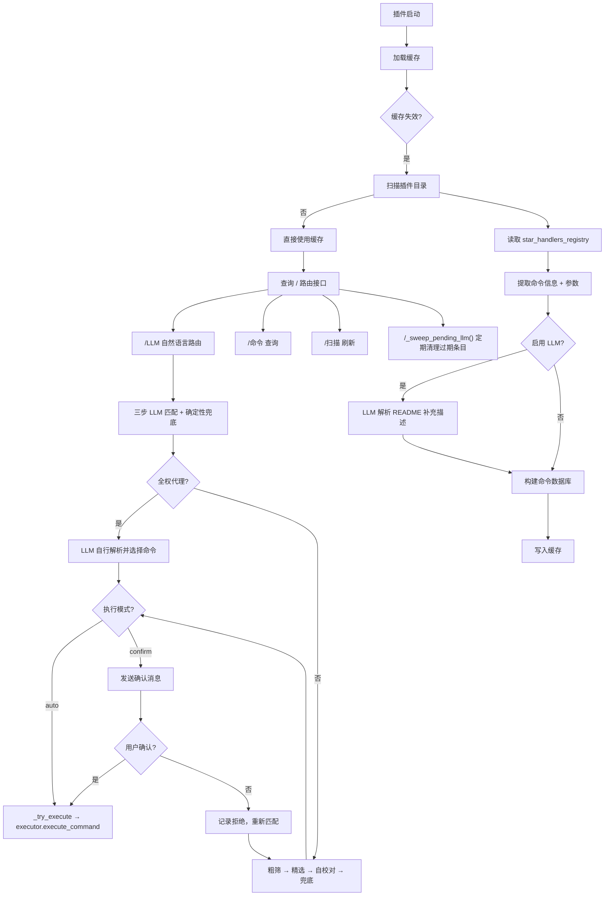

# astrbot_plugin_command_displayer

> **AstrBot 插件命令中枢 · LLM 驱动 · 自动扫描 · 命令路由**

[](https://github.com/Soulter/AstrBot)
[](LICENSE)

---

## 插件简介

**Command Displayer** 自动收集、解析并展示 AstrBot 中所有已安装插件的命令信息，并提供 **LLM 驱动的自然语言命令路由**——用自然语言描述需求，AI 直接匹配到具体命令并可自动执行。

核心亮点：

- **LLM 命令级路由**：自然语言描述 → 精确匹配到具体命令 + 参数，支持自动执行
- **三步匹配 + 兜底**：粗筛 Top-3 → 精选 → 自校对 → 确定性兜底，多层保障准确率
- **拒绝重匹配**：匹配不满意可拒绝，系统自动重新匹配并记住偏好
- **双执行模式**：`auto` 直接执行 / `confirm` 先确认后执行
- **LLM 全权代理**（可选）：LLM 接收全部命令缓存，自行解析意图、选择命令和提取参数
- **直接读取 + LLM 补充**：优先读取已注册指令，LLM 解析 README 补充描述

---

## 支持的命令

### `/LLM [自然语言]`

用自然语言描述你想做什么，AI 自动匹配最相关的**具体命令**。

| 用法 | 功能 |
|---|---|
| `/LLM` | 显示用法帮助 |
| `/LLM [自然语言]` | AI 匹配命令并执行（auto 模式）或确认后执行（confirm 模式） |

示例：
- `/LLM 查看天气` → 匹配 `/天气` 命令
- `/LLM 帮我查北京天气` → 匹配 `/天气 北京` 并执行
- `/LLM 有哪些管理相关的插件` → 展示所有相关命令

### `/命令 [子命令] [参数] [格式]`

| 用法 | 功能 |
|---|---|
| `/命令` | 显示用法帮助 |
| `/命令 all` / `/命令 全部` | 查看所有插件命令 |
| `/命令 [插件名]` | 查看指定插件命令（支持模糊搜索） |
| `/命令 delete all` | 删除全部记录 |
| `/命令 delete [插件名]` | 删除指定插件记录 |

格式参数（可选，追加在命令末尾）：`-s` 简洁 / `-d` 详细（默认）/ `-t` 表格

### `/全部插件`

列出所有已加载插件的名称、数据来源、命令数量和描述。

### `/扫描 [子命令]`

| 用法 | 功能 |
|---|---|
| `/扫描 all` | 全量扫描所有插件 |
| `/扫描 [插件名]` | 扫描指定插件 |
| `/扫描 add` | 增量扫描新增插件 |

### `/帮助`

显示本插件帮助信息。

---

## 工作原理



### 标准模式（三步匹配）

```
用户: /LLM 查看天气
  ↓
【粗筛】LLM 从命令索引返回 Top-3 候选
  ↓
【精选】LLM 根据功能描述选择最匹配的命令并提取参数
  ↓
【自校对】LLM 审核选择结果（可关闭，节省一次调用）
  ↓
【确定性兜底】检测命令描述中的否定短语，自动纠正冲突
  ↓
[auto] 直接执行  /  [confirm] 确认后执行
```

### 拒绝重匹配与持久化

confirm 模式下，用户回复非确认内容即视为拒绝，系统自动重新匹配并跳过被拒绝的命令：

```
系统: 匹配到 /全部插件，确认执行？
用户: 不对                    ← 拒绝，记录并重新匹配
系统: 已拒绝，正在重新匹配...
系统: 匹配到 /命令 all -d，确认执行？
用户: 确认                    ← 执行
（下次同样查询会自动跳过被拒绝的命令）
```

拒绝记录通过 `RejectionStore` 持久化到 `data/command_displayer/llm_rejections.json`，以 `normalized_query → [插件名|命令名]` 的格式存储。每次 LLM 路由时，已拒绝的命令会作为排除列表传入，确保同一查询不会重复匹配到错误命令。记录跨会话保留，重启不丢失。

### 全权代理模式

开启 `llm_full_proxy` 后，LLM 接收全部命令缓存，自行解析意图并决定执行方式（EXEC / SHOW / LIST_ALL / NONE）。

---

## 配置项

| 配置项 | 默认值 | 说明 |
|---|---|---|
| `plugins_directory` | `/AstrBot/data/plugins` | 插件目录路径 |
| `plugin_scan_interval` | `3600` | 后台扫描间隔（秒） |
| `cache_timeout` | `30` | 缓存有效期（分钟） |
| `max_readme_size` | `1048576` | README 最大读取大小（字节） |
| `max_commands_per_plugin` | `200` | 单个插件最大显示命令数 |
| `command_format` | `detailed` | 默认输出格式：`simple` / `detailed` / `table` |
| `enable_llm_analysis` | `true` | LLM 解析 README 补充命令描述 |
| `enable_llm_review` | `true` | LLM 自校对（多一次调用，提高准确率） |
| `enable_auto_reload` | `true` | 后台自动扫描 |
| `include_disabled_plugins` | `false` | 包含已禁用的插件目录（`_` 前缀） |
| `llm_execute_mode` | `confirm` | 执行模式：`auto`（直接执行）/ `confirm`（先确认） |
| `llm_full_proxy` | `false` | LLM 全权代理模式 |
| `log_level` | `INFO` | 日志级别：`DEBUG` / `INFO` / `WARNING` / `ERROR` |

---

## 常见问题

### Q：LLM 路由匹配不到命令？
- 确保已执行 `/扫描 all` 完成初始扫描
- 检查 LLM 提供商是否可用
- 尝试更具体的描述，如"查询天气"而非"天气"

### Q：匹配到的命令不对？
- confirm 模式下直接回复任意内容（非"确认"/"是"）即可拒绝，系统自动重新匹配
- 拒绝记录持久化保存，下次同样查询会自动跳过
- 开启 `enable_llm_review` 进一步提高准确率

### Q：auto 模式执行失败？
- 目标插件可能未注册 handler 或已被卸载/禁用
- 插件会降级为展示命令文本，可手动发送

### Q：有的插件没显示？
- 插件目录下没有 README.md 且未注册 handler
- LLM 解析失败（已自动容错）

### Q：扫描很慢？
- 首次扫描需调用 LLM 解析所有 README
- 后续使用缓存，几乎瞬时响应
- 关闭 `enable_llm_analysis` 可加速

---

## 依赖环境

- AstrBot ≥ **v4.0**
- 已配置 **LLM Provider**（OpenAI / Azure / Ollama / 本地模型均可）

---

## License

MIT License
