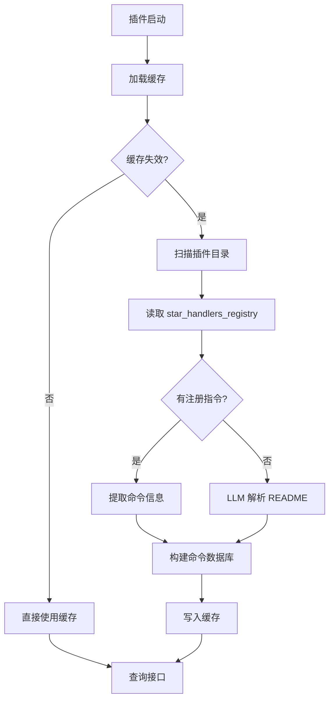

# astrbot_plugin_command_displayer

> **AstrBot 插件命令中枢 · LLM 驱动 · 自动扫描**

[](https://github.com/Soulter/AstrBot)
[](LICENSE)

---

## 插件简介

**Command Displayer** 是一个**开发给~~记不住插件命令又懒得看后台的懒狗~~的插件**，用于**自动收集、解析并展示 AstrBot 中所有已安装插件的命令信息**。

它通过 **LLM 解析插件 README.md**，提取命令结构，并提供统一的命令查询入口。

---

## 核心功能

**直接读取注册指令（优先）**
- 从 AstrBot 的 `star_handlers_registry` 直接读取所有已注册插件的指令和行为
- 无需调用 LLM，响应即时
- 自动提取命令名、别名、过滤器类型、描述等信息
- 支持指令（CommandFilter）、正则（RegexFilter）、平台过滤等多种过滤器类型

**LLM 智能解析 README（兜底）**
- 当插件未注册 handler 时，通过 LLM 解析 README.md 提取命令信息
- 自动提取：
  - 插件名称
  - 插件描述
  - 命令列表（含参数说明）
- 兼容各种 README 写作风格

**全自动扫描**
- 启动时自动扫描 `data/plugins`
- 支持后台定时刷新（可配置间隔）
- 支持手动触发全量/增量/单插件扫描

**命令查询系统**
- 查看所有插件命令（支持三种输出格式）
- 查看指定插件命令（支持模糊搜索）
- 列出所有插件名称及命令数量
- 删除单个或全部缓存记录

**长期缓存**
- 命令结果持久化到本地 JSON
- 重启不丢失
- 避免频繁调用 LLM

---

## 工作原理



---

## 支持的命令

### `/帮助`

显示本插件自身的命令语法帮助。

### `/命令 [子命令] [参数] [格式]`

| 用法 | 功能 |
|---|---|
| `/命令` | 显示 `/命令` 用法帮助 |
| `/命令 all` / `/命令 全部` | 查看所有插件命令 |
| `/命令 [插件名]` | 查看指定插件命令（支持模糊搜索） |
| `/命令 delete all` / `/命令 delete 全部` | 删除全部记录 |
| `/命令 delete [插件名]` | 删除指定插件记录 |

**格式参数**（可选，追加在命令末尾）：

| 参数 | 模式 | 说明 |
|---|---|---|
| `-s` | 简洁模式 | 只显示命令名和别名 |
| `-d` | 详细模式 | 显示命令名、别名和描述（默认） |
| `-t` | 表格模式 | 以表格形式输出 |

示例：`/命令 all -t`、`/命令 插件名 -s`

### `/全部插件`

列出所有已加载插件的名称、数据来源、命令数量和描述。

### `/扫描 [子命令]`

| 用法 | 功能 |
|---|---|
| `/扫描` | 显示 `/扫描` 用法帮助 |
| `/扫描 all` / `/扫描 全部` | 全量扫描所有插件 |
| `/扫描 [插件名]` | 扫描指定插件 |
| `/扫描 add` / `/扫描 增量` | 增量扫描新增插件 |

---

## 使用示例

### 查看帮助

```
/帮助
```

返回示例：

```
Command Displayer 命令帮助

  /命令 [子命令] [参数]
  /命令                    — 显示本帮助
  /命令 all / 全部          — 查看所有插件命令
  /命令 [插件名]            — 查看指定插件命令
  /命令 delete all / 全部   — 删除全部记录
  /命令 delete [插件名]     — 删除指定插件记录

  /扫描 [子命令]
  /扫描 all / 全部          — 全量扫描所有插件
  /扫描 [插件名]            — 扫描指定插件
  /扫描 add / 增量          — 增量扫描新增插件
```

---

### 查看所有命令

```
/命令 all
```

返回示例：

```
[OK] 成功获取行为列表
  总计: 48 个行为，6 个插件

--- [1/6] astrbot_plugin_codemage [直接] ---
  描述: 插件生成器
  共 10 条命令:

    [指令] /codemage - AI代码生成插件
    [指令] /codemage help - 查看帮助
    ...

--- [2/6] Epic免费游戏提醒 (astrbot_plugin_epic_free_games_notice) [直接] ---
  共 1 条命令:

    [指令] /epic - 查看本周 Epic 免费游戏

--- [3/6] 滴答清单连接器 (astrbot_plugin_dida365) [直接] ---
  描述: 滴答清单连接器
  共 11 条命令:

    [指令] /dida add [内容] - 添加待办事项
    [指令] /dida list - 列出待办
    ...

=== 共 6 个插件，48 条命令 ===
```

---

### 查看指定插件命令

```
/命令 dida365
```

返回示例：

```
========== [滴答清单连接器 (astrbot_plugin_dida365)] [直接] ==========
  描述: 滴答清单连接器
  共 11 条命令:

    [指令] /dida add [内容] - 添加待办事项
    [指令] /dida list - 列出待办
    ...

========== [滴答清单连接器 (astrbot_plugin_dida365)] 共 11 条命令 ==========
```

---

### 删除指定插件记录

```
/命令 delete dida365
```

返回示例：

```
[-] 已删除插件 `dida365` 的记录
```

---

### 列出所有插件

```
/全部插件
```

返回示例：

```
已加载 6 个插件，共 48 条命令：
   1. astrbot_plugin_codemage [直接] (10条) | 插件生成器
   2. astrbot_plugin_command_displayer [直接] (4条)
   3. astrbot_plugin_dida365 [直接] (11条) | 滴答清单连接器
   4. astrbot_plugin_epic_free_games_notice [直接] (1条) | Epic免费游戏提醒
   5. astrbot_plugin_zanwo [直接] (6条)
   6. main (内置) [直接] (16条)

共 6 个插件，48 条命令
```

---

### 全量扫描

```
/扫描 all
```

返回示例：

```
正在全量扫描插件命令，请稍候...
全量扫描完成，共加载 12 个插件的命令
```

---

### 增量扫描

```
/扫描 add
```

返回示例：

```
正在增量扫描新增插件...
增量扫描完成，未发现新插件
```

---

### 扫描指定插件

```
/扫描 dida365
```

返回示例：

```
正在扫描插件 `dida365`...
插件 `dida365` 扫描完成
```

---

## 配置项（config.json）

| 配置项 | 默认值 | 说明 |
|---|---|---|
| `plugins_directory` | `/AstrBot/data/plugins` | 插件目录 |
| `plugin_scan_interval` | `300` | 后台扫描间隔（秒） |
| `cache_timeout` | `30` | 缓存有效期（分钟） |
| `max_readme_size` | `1048576` | README 最大读取大小（字节） |
| `max_commands_per_plugin` | `200` | 单个插件最大命令数 |
| `command_format` | `detailed` | 默认输出格式（simple/detailed/table） |
| `fuzzy_search_threshold` | `0.6` | 模糊搜索阈值（0.0-1.0） |
| `enable_auto_reload` | `true` | 是否启用后台自动扫描 |
| `enable_llm_analysis` | `true` | 是否启用 LLM 解析 README |
| `include_disabled_plugins` | `false` | 是否包含已禁用的插件（以 `_` 开头的目录） |
| `log_level` | `INFO` | 日志级别（DEBUG/INFO/WARNING/ERROR） |


## 依赖环境

- AstrBot ≥ **v4.0**
- 已配置 **LLM Provider**
  - OpenAI / Azure / Ollama / 本地模型均可
- 插件目录中存在 README.md

---

## 常见问题

### Q：为什么有的插件没显示？
A：
- 插件目录下 **没有 README.md**
- README 内容无法被 LLM 解析
- LLM 返回数据不完整（已自动容错）

### Q：扫描很慢？
A：
- 首次扫描需要调用 LLM
- 后续使用缓存，几乎瞬时响应

### Q：支持自定义命令格式吗？
A：
- 支持任意 README 写法
- LLM 会自动推断结构

---

##  License

MIT License

---

## 🙏 致谢

- AstrBot 项目
- 所有提供高质量 README 的插件作者
